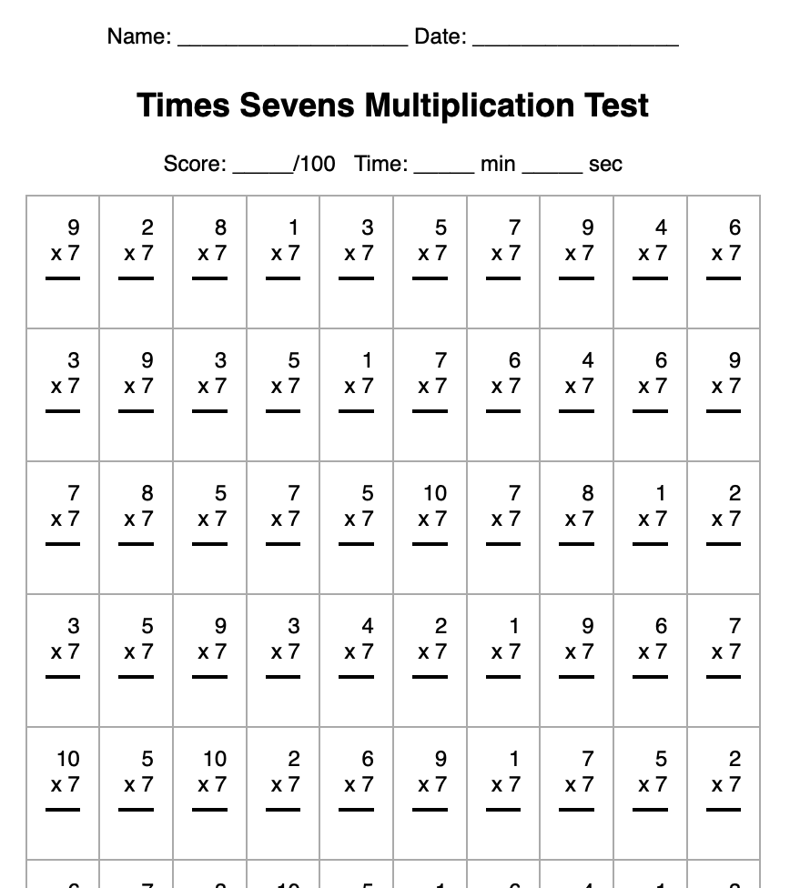

## Jake's Free Elementary Math Sheets

These pages are created on the fly using JavaScript, so your browser will need to have Javascript enabled for this site.

They are available online at [https://absent.org/math/](https://absent.org/math/)

You can also just clone the repo locally and open up index.html.

## To-Do

* Implement Addition
* Implement Subtraction
* Implement Division

If you like these pages, and you're feeling generous, you may send Bitcoin to `bc1qhau4ayzyfrntnm67zku4c2es3yn7u7mekw6afh`